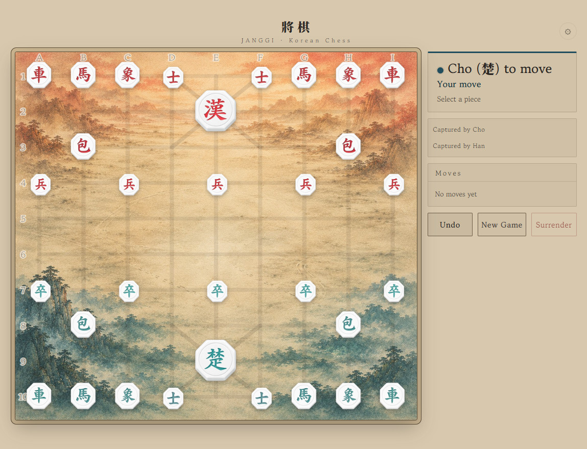

# Janggi · Korean Chess

Traditional Korean Janggi in your browser — an AI opponent with four difficulty tiers, interactive tutorials, multilingual support, and handcrafted Korean-inspired board themes.

**[▶ Play Online](https://korea-janggi.pages.dev)**

> The Sansuhwa (ink-wash landscape) board at the opening setup. Visual assets are All Rights Reserved — see [ASSETS_LICENSE.md](ASSETS_LICENSE.md).

---

## Features

- **Play against the AI** — powered by [Fairy-Stockfish](https://github.com/fairy-stockfish/Fairy-Stockfish) (WebAssembly), across four difficulty tiers:
  - 🌱 **Beginner** — for someone learning Janggi for the first time
  - 🍃 **Familiar Friend** — a relaxed opponent for a casual game
  - 🎋 **Seasoned Player** — rarely leaves an opening
  - 🏮 **Master** — allows not a single opening
- **Interactive piece tutorials** — learn how each piece moves, step by step
- **Rules reference for beginners** — check, checkmate, and how to win, explained in plain language
- **Traditional Korean board themes**
  - Sansuhwa (Ink Wash Landscape)
  - Wood
  - Sipjangsaeng
  - Hanji
- **Multiple languages**
  - English
  - 한국어 (Korean)
  - 日本語 (Japanese)
  - 简体中文 (Simplified Chinese)
  - 繁體中文 (Traditional Chinese)
  - Deutsch (German)
  - Français (French)
- **Mobile and desktop support** — responsive layout for both

---

## What is Janggi?

Janggi is a traditional Korean strategy board game, often described as Korean Chess. While it shares some roots with Xiangqi and similarities with Chess, it has unique rules and tactics of its own — including the diagonal palace lines, the cannon (包) that leaps over a single piece, and the option to pass a turn.

The two sides, **Cho (楚)** and **Han (漢)**, take their names from the historic rivalry between the kingdoms of Chu and Han in ancient China.

---

## Difficulty

The four tiers are built on the Fairy-Stockfish engine, adjusted along a few axes
so the climb from beginner to master feels natural:

- **Search depth and skill level** rise with each tier — the higher tiers look
  further ahead and play more precisely.
- **The lower tiers mix in occasional deliberate slips**, so a beginner can win
  with focus, while the Master concedes nothing.

At every tier the engine still recognises immediate wins and threats; the easier
opponents simply don't always choose the sharpest line. **Beginner** is tuned so
that a newcomer who plays carefully can win some of the time — not a pushover, not
a wall. **Master** plays at full strength and is meant as a genuine challenge.

---

## Tech

- Vanilla JavaScript, HTML, and CSS (no framework)
- AI opponent via [Fairy-Stockfish](https://github.com/fairy-stockfish/Fairy-Stockfish) (GPLv3) compiled to WebAssembly
- Requires cross-origin isolation (`COOP`/`COEP`) for the WASM engine
- Deployed on Cloudflare Pages

---

## License

The code and the visual assets are licensed separately.

- **Code** (`index.html`, `style.css`, `script.js`, `engine.js`, etc.) — [GNU General Public License v3.0](LICENSE). This follows from integrating Fairy-Stockfish, which is GPLv3.
- **Visual assets** (board backgrounds, piece artwork, and other theme/UI images under `assets/`) — **All Rights Reserved** by Hanrim. They are *not* covered by the GPLv3 and may not be redistributed or reused when forking the code. See [ASSETS_LICENSE.md](ASSETS_LICENSE.md) for details.

If you fork or redistribute this project, the GPLv3 applies to the code only; the visual assets must not be redistributed with it.
